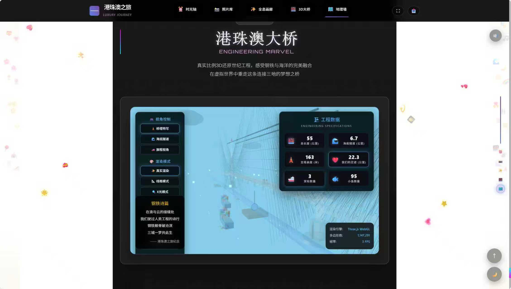
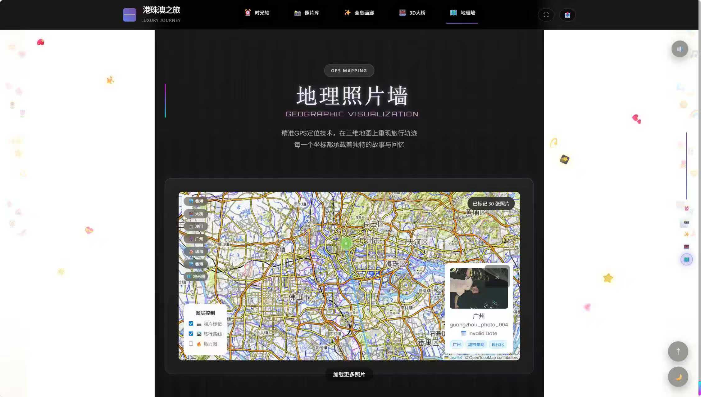
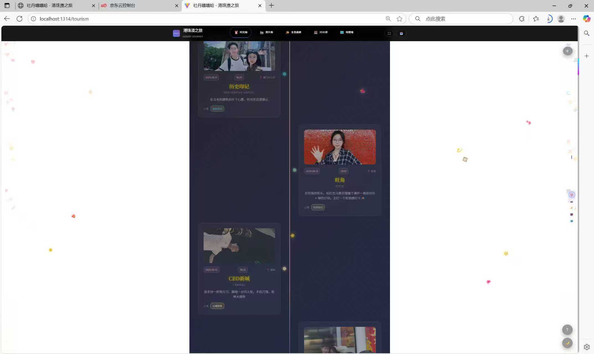
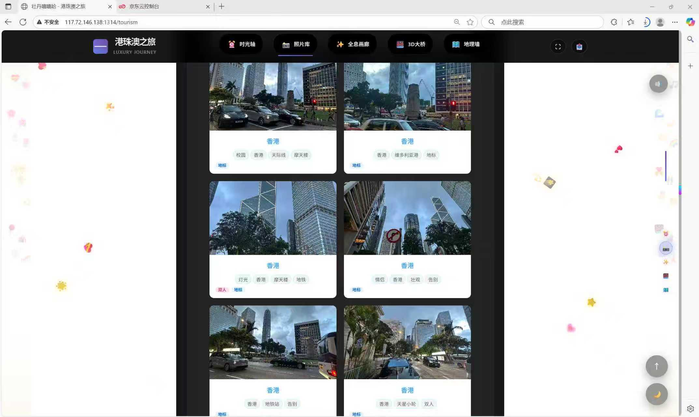
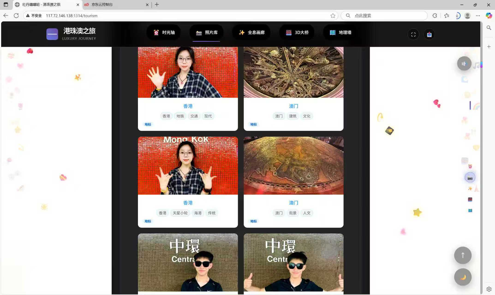

# ❤️ LoveSpace - Vue 专属浪漫纪念网站

<p align="center">
  
</p>

<p align="center">
  <a href="https://vuejs.org/"></a>
  <a href="https://developer.mozilla.org/en-US/docs/Web/JavaScript"></a>
  <a href="https://vitejs.dev/"></a>
  
  
</p>

---

## 📖 项目简介 (Introduction)

**LoveSpace** 是一款基于 **Vue.js** 框架精心打造的现代化情侣/个人纪念网站。它不仅仅是一行行代码，更是时光的容器。

本项目采用响应式设计，完美适配 PC 端与移动端。通过极简的深色系 UI 风格，结合地图轨迹、时间轴回忆、动态照片墙等功能，记录下每一个珍贵的瞬间。无论是作为周年纪念礼物，还是个人的美好回忆录，这都是一份独一无二的数字资产。

## ✨ 核心特性 (Features)

* **🎨 沉浸式 UI 设计**：采用现代化的深色模式（Dark Mode），视觉体验高端大气，突出内容本身。
* **🗺️ 爱的足迹 (Map)**：集成地图组件，可视化展示你们一起去过的城市和打卡点。
* **⏳ 时光轴 (Timeline)**：以时间为线索，串联起从相识到现在的每一个重要里程碑。
* **📷 动态照片墙 (Gallery)**：瀑布流或网格布局展示甜蜜合照，支持预览与交互。
* **📱 全端适配**：基于 Flex/Grid 布局，无论是手机访问还是电脑浏览，体验如丝般顺滑。
* **🔐 专属空间**：支持特定入口或密码访问，保护隐私回忆。

---

## 📸 视觉展览 (Gallery Showcase)

> 以下截图均为项目实机运行效果。

### 1. 首页与时光概览
简洁大气的首页设计，记录相恋天数与核心导航。

| 首页视觉 | 纪念日历 |
| :---: | :---: |
|  |  |

### 2. 足迹与回忆
记录我们走过的每一寸土地，以及那些难忘的瞬间。

| 足迹地图 | 照片墙 |
| :---: | :---: |
|  |  |

### 3. 移动端适配
在手机上也能随时随地翻阅我们的故事。

<div align="center">
  
  
</div>

---

## 🛠️ 技术栈 (Tech Stack)

* **前端框架**: Vue.js (Vue 2/3)
* **路由管理**: Vue Router
* **构建工具**: Vite / Webpack
* **样式预处理**: Less / Sass

## 🚀 快速开始 (Quick Start)

如果你想在本地运行该项目，请按照以下步骤操作：

### 1. 克隆项目
```bash
git clone [https://github.com/your-username/love-website-vue.git](https://github.com/your-username/love-website-vue.git)
cd love-website-vue
